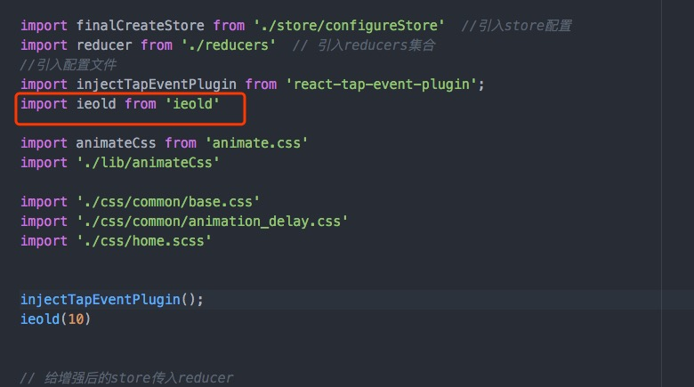

# ieold  [](https://github.com/976500133/IE-FBI-WARNing)


<p align="center"><b>🔥 IEOLD?</b><br>In the process of the development of the website, whether it is graceful degradation and progressive enhancement, the total 1 IE is not suitable for you, but for better user experience, you definitely need a face I don't compatible browser script that has been submitted to the site of strong and friendly interaction, so you should be used to
.</p>


在开发网站的过程中，不管是优雅降级和渐进增强，总有1款IE 不适合你，然而为了更好的用户体验，你肯定需要一款面对我不兼容浏览器脚本的提示，已提交网站的健硕和友好的交互，由此你应该用的到
IE-FBI-WARNing


This is a generic version of the browser in a full screen friendly prompts users
To replace the browser's small script, display the following:


这是通用的一个在低版本浏览器上以全屏形式友好提示用户
更换浏览器的小脚本，展示效果如下：

See any browser directly open index.html
看效果任何浏览器直接打开index.html


###Effect display 效果图()


## Install

```
$ npm install --save ieold
```

## Usage Method 1

```js
//=> react
//
import ieold from 'ieold'
// @param version
// version <=  (6-11)
//
ieold(9)

```


## Usage Method 2


```js
//=> common
//
const ieold = require('ieold');
ieold(9)

```


## Usage Method 3

```js
//=> 普通引用 common including
<script type="text/javascript" src="index.src.js"></script>

//IE 10 以上
<script type="text/javascript" >
  if (navigator.userAgent.match(/Trident\/6/)) {
      document.write('<script src="index.src.js"><'+'/script>');
  }
</script>

```




http://www.jianshu.com/p/811d56f5ddd8


##merit 优点

1.使用方便，只需加几行 IE-only 的条件注释代码，对现代浏览器不会产生任何影响

1.Easy to use, just need to add a few lines of IE-only conditional comment code, will not have any impact on modern browsers


2.大小：整站才45Kb（包含图片）

2.Size: 45Kb station (including images)


3.醒目，目前多数的网站做法只是在顶部很窄的位置提示一句话，达不到鼓励用户更换浏览器的目的。而本身是否完全放弃 IE 也是网站自己的选择。此脚本明显地告知用户，之后遇到样式和功能不正常是因为你已经落伍了。

3.Eye-catching, at present, most of the site practice is only a very narrow position on the tip of a word, can not achieve the purpose of encouraging users to replace the browser. And whether or not to completely abandon the IE site is their own choice. This script clearly informs the user that the style and function are not normal because you are out of date.
